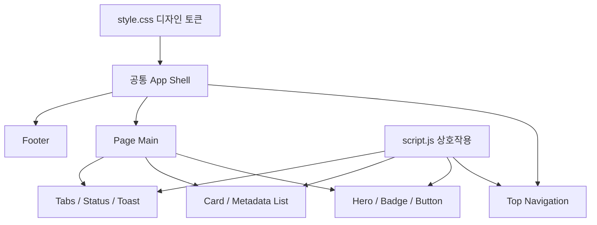

# ZEIV Portfolio — 코드 구조도

Astryx는 React 19 이상을 요구하는 React 컴포넌트 라이브러리입니다. 이 프로젝트는 요청한 `HTML + CSS + JavaScript` 멀티페이지 구조를 유지하기 위해 Astryx의 App Shell, Top Nav, Card, Badge, Button, Segmented Control, Status Dot, Toast 패턴과 시맨틱 토큰 체계를 순수 웹 표준으로 재구현합니다.

```text
ZEIV-portfolio/
├── index.html       # 메인: 소개, 대표 프로젝트, 수상·뉴스 미리보기
├── about.html       # 소개, 직무, 한 줄 소개, 소개글, Skills, 경력
├── project.html     # Project 1/2 상세 정보와 카테고리 필터
├── awards.html      # 수상 및 주요 활동
├── news.html        # 소식 및 업데이트
├── style.css        # Astryx-inspired 토큰 + 공통 컴포넌트 + 반응형
├── script.js        # 메뉴, 테마, 필터, 스크롤 등장, 토스트
└── STRUCTURE.md     # 이 구조도와 수정 가이드
```



## 콘텐츠 수정 위치

- 이름과 기본 소개: 모든 HTML의 로고 및 `index.html`, `about.html`
- 직무·한 줄 소개·소개글·Skills·경력: `about.html`
- 프로젝트명·설명·역할·주요 작업·결과: `project.html`
- 수상: `awards.html`
- 소식: `news.html`
- 이메일: 모든 HTML의 `hello@zeiv.com`
- 색상·글꼴·간격: `style.css`의 `:root` 토큰

## 고정 UI 정책

- 모든 페이지 헤더의 `System / Light / Dark` 테마 선택기는 사용자 고정 설정입니다.
- 후속 페이지 추가나 부분 수정 시 테마 선택기를 삭제하거나 다른 기능으로 교체하지 않습니다.
- 사용자가 선택한 테마는 `localStorage`의 `zeiv-theme` 값으로 페이지 사이에서 유지합니다.
- 관광지 상세 팝업의 기본 밝은 배경은 기존 디자인 토큰의 웜 아이보리 `#f6f2ec`를 사용합니다.
